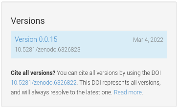

# Zenodo Action

This is a quick helper action to allow you to automatically update a package on zenodo
on release, and without needing to enable admin webhooks. To get this working you will need to:

1. Create an account on Zenodo
2. Under your name -> Applications -> Developer Applications -> Personal Access Tokens -> +New Token and choose both scopes for deposit
3. Add the token to your repository secrets as `ZENODO_TOKEN`
4. Create a .zenodo.json file for the root of your repository (see [template](.zenodo.json))
5. Add the example action (modified for your release) to your GitHub repository.

[Here is an example](https://zenodo.org/record/6326823) of a release created by this action, and the metadata associated:

```
doi https://doi.org/10.5281/zenodo.6326823
conceptdoi https://doi.org/10.5281/zenodo.6326822
conceptbadge https://zenodo.org/badge/doi/10.5281/zenodo.6326822.svg
badge https://zenodo.org/badge/doi/10.5281/zenodo.6326823.svg
bucket https://zenodo.org/api/files/dbcddadd-4ea9-4f66-8045-e15552399dbc
latest https://zenodo.org/api/records/6326823
latest html https://zenodo.org/record/6326823
record https://zenodo.org/api/records/6326823
record html https://zenodo.org/record/6326823
```
 
**Important** You CANNOT create a release online first and then try to upload to the same DOI.
If you do this, you'll get:

```python
{'status': 400,
 'message': 'Validation error.',
 'errors': [{'field': 'metadata.doi',
   'message': 'The prefix 10.5281 is administrated locally.'}]}
```

I think this is kind of silly, but that's just me.

## Usage

When looking at artifacts in Zenodo you'll see a versions card like the image below.  This artifact has
only one version, 0.0.15. By default, this is the behavior of this action - to create brand new artifacts
with only one version.

If, however, you'd like to make new versions you can specify the doi that represents *all*
versions. In this image you would specify `10.5281/zenodo.6326822`.  This action will then
create new versions tied to this DOI.



### GitHub Action

After you complete the steps above to create the metadata file, you might create a release
action as follows:

```yaml
name: Zenodo Release

on:
  release:
    types: [published]

jobs:
  deploy:
    runs-on: ubuntu-20.04

    steps:
    - uses: actions/checkout@v3
    - name: download archive to runner
      env:
        tarball: ${{ github.event.release.tarball_url }}
      run: |
        name=$(basename ${tarball})        
        curl -L $tarball > $name
        echo "archive=${name}" >> $GITHUB_ENV

    - name: Run Zenodo Deploy
      uses: rseng/zenodo-release@main
      with:
        token: ${{ secrets.ZENODO_TOKEN }}
        version: ${{ github.event.release.tag_name }}
        zenodo_json: .zenodo.json
        archive: ${{ env.archive }}

        # Optional DOI for all versions. Leaving this blank (the default) will create
        # a new DOI on every release. Use a DOI that represents all versions will
        # create a new version for this existing DOI.
        #
        # Newer versions have their own DOIs, but they're also linked to this DOI
        # as a different version. When using this, use the DOI for all versions.
        doi: '10.5281/zenodo.6326822'
```

Notice how we are choosing to use the .tar.gz (you could use the zip too at `${{ github.event.release.zipball_url }}`)
and using the default zenodo.json that is obtained from the checked out repository.
We also grab the version as the release tag. We are also running on the publication of a release.
If you want to see or do something with the outputs, add an `id` to the deploy step and do:

```yaml
    - name: Run Zenodo Deploy
      id: deploy
      uses: rseng/zenodo-release@main
      with:
        token: ${{ secrets.ZENODO_TOKEN }}
        version: ${{ github.event.release.tag_name }}
        zenodo_json: .zenodo.json
        archive: ${{ env.archive }}

    - name: View Outputs
      env:
        doi: ${{ steps.deploy.outputs.doi }} 
        conceptdoi: ${{ steps.deploy.outputs.conceptdoi }} 
        conceptbadge: ${{ steps.deploy.outputs.conceptbadge }} 
        badge: ${{ steps.deploy.outputs.badge }} 
        bucket: ${{ steps.deploy.outputs.bucket }} 
        latest: ${{ steps.deploy.outputs.latest }} 
        latest_html: ${{ steps.deploy.outputs.latest_html }} 
        record: ${{ steps.deploy.outputs.record }} 
        record_html: ${{ steps.deploy.outputs.record_html }} 
      run: |
        echo "doi ${doi}"
        echo "conceptdoi ${conceptdoi}"
        echo "conceptbadge ${conceptbadge}"
        echo "badge ${badge}"
        echo "bucket ${bucket}"
        echo "latest ${latest}"
        echo "latest html ${latest_html}"
        echo "record ${record}"
        echo "record html ${record_html}"
```

### Local

If you want to use the script locally (meaning to manually push a release) you can wget
or download the release (usually .tar.gz or .zip) and then export your zenodo token and do
the following:

```bash
export ZENODO_TOKEN=xxxxxxxxxxxxxxxxxxxx

                                  # archive    # identifier   # version
$ python scripts/deploy.py upload 0.0.0.tar.gz 6326700        --version 0.0.0
```

